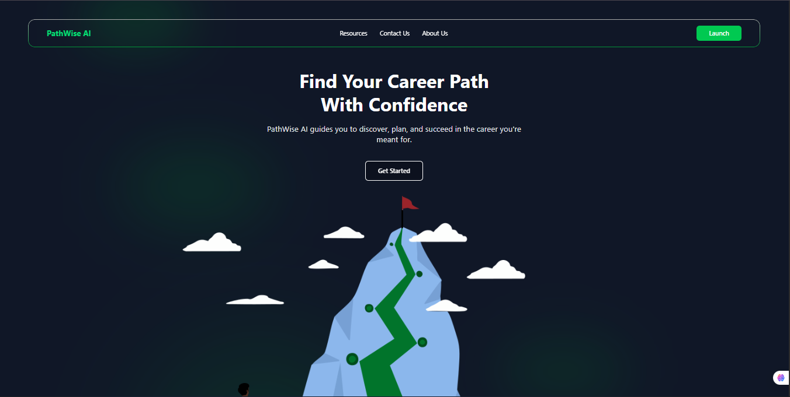

# PathWise-AI



PathWise-AI is an interactive career guidance platform designed to help Nigerian graduates and job seekers explore career paths, build relevant skills, and complete hands-on projects. The platform provides curated learning roadmaps, assessments, and project workspaces for various tech and professional roles.

## Features

- **Career Roadmaps:** Step-by-step skill trees for roles like Frontend Developer, Backend Developer, Fullstack Developer, Product Designer, and more.
- **Skill Assessments:** Interactive quizzes to validate your knowledge and earn certificates.
- **Project Workspaces:** Guided, real-world projects with code editors and progress tracking.
- **Resource Library:** Curated links to top learning materials for each skill.
- **AI Agent Integration:** Powered by AIQ toolkit for intelligent career guidance and recommendations.
- **Responsive UI:** Built with React, Tailwind CSS, and Vite for fast, modern web experience.

## Folder Structure

```
PathWise-frontend/
├── public/
│   ├── images/
│   └── ...icons and manifest
├── src/
│   ├── assets/
│   ├── components/
│   ├── data/
│   ├── pages/
│   ├── App.jsx
│   ├── main.jsx
│   └── ...
├── index.html
├── package.json
├── tailwind.config.js
├── vite.config.js
└── ...
```

- **components/**: React UI components (e.g., `Projects.jsx`, `Skills.jsx`, `Result.jsx`)
- **data/**: Static data for skills, roles, and projects (e.g., `SkillsData.js`, `roleProjectSets.js`)
- **pages/**: Top-level route components (e.g., `About.jsx`)
- **assets/**: Images and static assets

## Prerequisites

- Windows 10/11 with WSL2
- Internet connection for downloading packages

---

# 🚀 Complete Installation & Setup Guide

This guide walks you through setting up the PathWise AI project inside **WSL Ubuntu** from scratch. Follow the steps carefully, and by the end, you'll have both the frontend and backend running with MongoDB connected.

## 1️⃣ Install WSL and Ubuntu

Run this command from **PowerShell** (as Administrator) on Windows to install WSL with Ubuntu:

```bash
wsl --install
```

After installation, **restart your PC** and open Ubuntu (WSL) from your terminal dropdown.

## 2️⃣ Update Ubuntu Packages

Inside Ubuntu, update and upgrade your system:

```bash
sudo apt update && sudo apt upgrade -y
```

**Note:** You will be prompted to enter your **system password** (the password you use to log into your Windows laptop). Type it carefully as characters won't be displayed on screen.

## 3️⃣ Install Python 3

Ubuntu usually comes with Python 3 preinstalled. Confirm the installation:

```bash
python3 --version
```

If not installed or you need additional Python tools:

```bash
sudo apt install -y python3 python3-venv python3-pip
```

## 4️⃣ Clone the Repository

Clone the PathWise AI repository:

```bash
git clone https://github.com/codewithgaji/PathWise-AI.git
cd PathWise-AI
```

## 5️⃣ Open a new terminal in Pathwise cloned file. Open it in WSL/Ubuntu terminal, create and Activate Python Virtual Environment

Create a virtual environment:

```bash
python3 -m venv .venv
```

Activate the virtual environment:

```bash
source .venv/bin/activate
```

**Important:** Once activated, you should see `(.venv)` at the beginning of your terminal prompt.

## 6️⃣ Install curl

Install curl, which we'll need for downloading Node.js:

```bash
sudo apt install -y curl
```

## 7️⃣ Remove Outdated Node.js and npm

The default Ubuntu repositories often have outdated Node.js and npm. Remove them first:

```bash
sudo apt remove -y nodejs npm
sudo apt autoremove -y
```

## 8️⃣ Install Latest Node.js (LTS)

Add the official NodeSource repository for Node.js 20.x LTS:

```bash
curl -fsSL https://deb.nodesource.com/setup_20.x | sudo -E bash -
```

Install Node.js:

```bash
sudo apt install -y nodejs
```

Verify the installation:

```bash
node -v
npm -v
```

## 9️⃣ Install MongoDB

MongoDB doesn't yet provide repositories for Ubuntu "Noble" (24.04). We'll use the Jammy (22.04) repository which is fully compatible.

### Add MongoDB GPG Key
```bash
wget -qO - https://www.mongodb.org/static/pgp/server-7.0.asc | sudo tee /usr/share/keyrings/mongodb-server-7.0.gpg > /dev/null
```

### Add MongoDB Repository
```bash
echo "deb [ arch=amd64,arm64 signed-by=/usr/share/keyrings/mongodb-server-7.0.gpg ] https://repo.mongodb.org/apt/ubuntu jammy/mongodb-org/7.0 multiverse" | sudo tee /etc/apt/sources.list.d/mongodb-org-7.0.list
```

### Update Package Lists
```bash
sudo apt update
```

### Install MongoDB
```bash
sudo apt install -y mongodb-org
```

## 🔟 Start and Enable MongoDB

Start MongoDB immediately:

```bash
sudo systemctl start mongod
```

Enable MongoDB to auto-start on system boot:

```bash
sudo systemctl enable mongod
```

Check MongoDB status:

```bash
sudo systemctl status mongod
```

**Expected output:** You should see `Active: active (running)` in green text.

### Verify MongoDB Connection

Test the MongoDB connection:

```bash
mongosh --eval 'db.runCommand({ connectionStatus: 1 })'
```

If MongoDB is working correctly, you should see `"ok" : 1` in the output 🎉.

## 1️⃣1️⃣ Setup Frontend

Navigate to the frontend folder and install dependencies:

```bash
cd Pathwise-frontend
npm install
```

Start the frontend development server:

```bash
npm run dev
```

If successful, your frontend will start running on `http://localhost:5173`.

## 1️⃣2️⃣ Setup Backend

**Open a new terminal** in Ubuntu (WSL) while keeping the frontend running.

Navigate to your project root and activate the Python environment:

```bash
cd PathWise-AI
source .venv/bin/activate
```

Move into the backend folder:

```bash
cd Pathwise-backend
```

Install backend dependencies and start the server:

```bash
npm install
npm start
```

If MongoDB is running properly, the backend should connect successfully.

## 1️⃣3️⃣ Setup AI Agent

**Open a third terminal** and navigate to the project root:

```bash
cd PathWise-AI
source .venv/bin/activate
```

Install uv and AI dependencies:

```bash
pip install uv
uv add aiqtoolkit
uv add fastapi uvicorn
```

Install the agent:

```bash
uv pip install -e .
uv pip install -e nigeria_pathwise
```

Configure AI Agent:

```bash
# Delete existing agent to remove system symlink
nat workflow delete nigeria_pathwise

# Create the agent
nat workflow create nigeria_pathwise
```

Update Agent Files by replacing the following files with the latest versions from the repository:

Replace:
- `nigeria_pathwise/src/nigeria_pathwise/nigeria_pathwise_function.py`

with:

- `vector.py` in the repo.


Run the AI Agent:

```bash
nat serve --config_file nigeria_pathwise/configs/config.yml
```

**Open another terminal in WSL/Ubuntu mode not powershell**

## 1️⃣4️⃣ Install Flask Dependencies

In a new terminal, activate the environment and install Flask:

```bash
cd PathWise-AI
source .venv/bin/activate
pip install flask flask_cors
```


## 1️⃣5️⃣ After that run:
```sh
python cors_proxy.py
```

Then this server should activate as well, and you are good to go 🎉🎉🎉🎊


## ✅ Final Verification

You should now have:

1. **Frontend running** on `http://localhost:5173`
2. **Backend running** on the configured port
3. **MongoDB active** and connected
4. **AI Agent** running with FastAPI

## 🔧 Important Notes

- **Virtual Environment:** Always activate your virtual environment (`source .venv/bin/activate`) before running backend commands or installing Python packages.
- **MongoDB:** MongoDB is installed system-wide in Ubuntu, not inside your Python virtual environment.
- **Auto-start:** With `systemctl enable`, MongoDB will automatically start every time WSL boots up.
- **Terminal Management:** Keep your frontend, backend, and AI agent running in separate terminal windows.

## 🚨 Troubleshooting

### MongoDB Connection Issues:
```bash
# Check if MongoDB is running
sudo systemctl status mongod

# Restart MongoDB if needed
sudo systemctl restart mongod
```

### Node.js Installation Issues:
- Make sure you're connected to the internet
- Try running `sudo apt update` again before the curl command

### Virtual Environment Issues:
- Make sure you're in the correct directory
- Try recreating it: `rm -rf .venv && python3 -m venv .venv`

### General Issues:
- Ensure all ports are available (5173 for frontend, backend port, AI agent port)
- Check browser console and backend logs for specific error messages
- Verify environment variables are properly configured

## Development

### Build for Production

```bash
npm run build
```

### Linting

```bash
npm run lint
```

## Customization

- To add or edit skills, modify `SkillsData.js`.
- To update project sets for each role, edit `roleProjectSets.js`.
- UI components can be found in `components/`.
- AI agent configuration can be modified in the `config.yml` file.

## License

[MIT](LICENSE)

---

*Made for Nigerian graduates and job hunters by students*