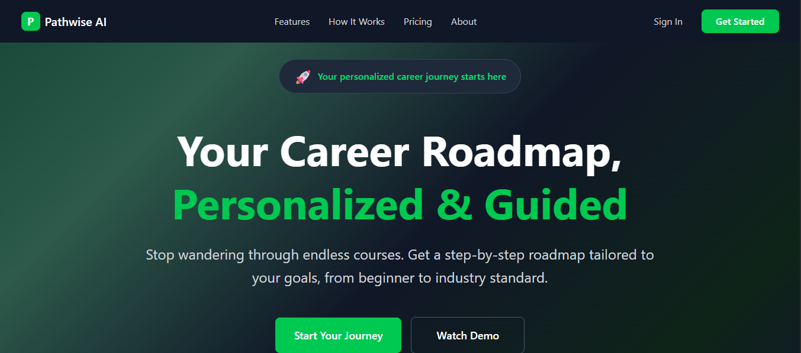

# PathWise-AI

PathWise-AI is an interactive career guidance platform designed to help Nigerian graduates and job seekers explore career paths, build relevant skills, and complete hands-on projects. The platform provides curated learning roadmaps, assessments, and project workspaces for various tech and professional roles.

## Features

- **Career Roadmaps:** Step-by-step skill trees for roles like Frontend Developer, Backend Developer, Fullstack Developer, Product Designer, and more.
- **Skill Assessments:** Interactive quizzes to validate your knowledge and earn certificates.
- **Project Workspaces:** Guided, real-world projects with code editors and progress tracking.
- **Resource Library:** Curated links to top learning materials for each skill.
- **Responsive UI:** Built with React, Tailwind CSS, and Vite for fast, modern web experience.

## Folder Structure

```
PathWise-frontend/
├── public/
│   ├── images/
│   └── ...icons and manifest
├── src/
│   ├── assets/
│   ├── components/
│   ├── data/
│   ├── pages/
│   ├── App.jsx
│   ├── main.jsx
│   └── ...
├── index.html
├── package.json
├── tailwind.config.js
├── vite.config.js
└── ...
```

- **components/**: React UI components (e.g., `Projects.jsx`, `Skills.jsx`, `Result.jsx`)
- **data/**: Static data for skills, roles, and projects (e.g., [`SkillsData.js`](src/data/SkillsData.js), [`roleProjectSets.js`](src/data/roleProjectSets.js))
- **pages/**: Top-level route components (e.g., `About.jsx`)
- **assets/**: Images and static assets

## Getting Started

### Prerequisites

- [Node.js](https://nodejs.org/) (v16+ recommended)
- [npm](https://www.npmjs.com/) or [yarn](https://yarnpkg.com/)

### Installation

1. Clone the repository:
   ```sh
   git clone https://github.com/yourusername/pathwise-ai.git
   cd PathWise-frontend
   ```

2. Install dependencies:
   ```sh
   npm install
   # or
   yarn install
   ```

3. Start the development server:
   ```sh
   npm run dev
   # or
   yarn dev
   ```

4. Open [http://localhost:5173](http://localhost:5173) in your browser.

### Build for Production

```sh
npm run build
# or
yarn build
```

### Linting

```sh
npm run lint
# or
yarn lint
```

## Customization

- To add or edit skills, modify [`SkillsData.js`](src/data/SkillsData.js).
- To update project sets for each role, edit [`roleProjectSets.js`](src/data/roleProjectSets.js).
- UI components can be found in [`components/`](src/components/).

## License

[MIT](LICENSE)

---

*Made for Nigerian graduates and job hunters by students
